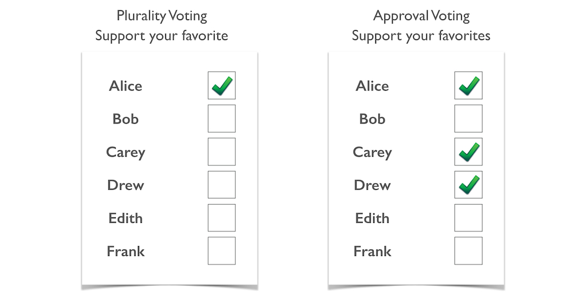

## Range voting (also known as score voting)

In this type of ranking, voters are given a ballot and give each choice a rating from one to five stars. Then we average the ratings and the candidates with the highest ratings will win. 

**Use cases of range vote**

Political use:

To crude form of the score voting was apparently used in some elections in ancient Sparta, by measuring how loudly the crowd shouted for different candidates. This has a modern-day analog of using clapometers in some television shows and the judging processes of some athletic competitions.

The Republic of Venice elected the Doge in a multi-round system, with the round that actually named the Doge being a three point score election (For, Neutral, Against). This process was used continually, with only minor changes, for over 500 years, until the republic was conquered by Napoleon.

A modern governmental example is the selection process for the Secretary-General of the United Nations, which also you a three-point scale ("Encourage," "Discourage," and "Not Opinion").

Score voting is used by the Green Party of Utah to elect officers, on a 0–9 scale.

Non-political use:

 1. Any mechanism that includes "giving some number of stars" as a rating (such as rating movies on IMDb, products at Amazon, apps in the iOS or Google Play stores, etc.)
 2. Sports such as gymnastics rate competitors on a numeric scale, although the fact that judges' ratings are public makes it less likely for them to engage in blatant tactical voting.
 3. A multi-winner variant, re-weighted score voting, is used to select five nominees for the Academy Award for Best Visual Effects using a 0–10 scale.
 4. Wikimedia's Board of Trustees and Wikipedia's Arbitration Committee are elected using a three-point scale ("Support", "Neutral", "Oppose"). Ballots are tallied equivalently to averaged approval voting, with "Neutral" treated as abstention.

## Range voting (also known as score voting)

Approval voting is a method of voting in which voters can vote for ("approve of") as many candidates as they wish in an election. The candidate chosen the most wins.

Approval Voting is most often discussed in the context of single-winner elections, but variations using an approval-style ballot can also be applied to multi-winner (at-large) elections. 

**Use cases of approval vote**

1. Independent Party of Oregon

Approval voting has been used in privately administered nomination contests by the Independent Party of Oregon in 2011, 2012, 2014, and 2016. 

Oregon is a fusion voting state, and the party has cross-nominated legislators and statewide officeholders using this method; its 2016 presidential preference primary did not identify a potential nominee due to no candidate earning more than 32% support. 

It is also used in internal elections by the American Solidarity Party, the Green Parties of Texas and Ohio, the Libertarian parties of Texas and Colorado, the US Modern Whig party, and the German Pirate Party.

2. Dartmouth Alumni Association elections

Approval voting was used for Dartmouth Alumni Association elections for seats on the College Board of Trustees, but after some controversy it was replaced with traditional runoff elections by an alumni vote of 82% to 18% in 2009. 

Dartmouth students started to use approval voting to elect their student body president in 2011. In the first election, the winner secured the support of 41% of voters against several write-in candidates. 

In 2012, Suril Kantaria won with the support of 32% of the voters. In 2013, 2014 and 2016, the winners also earned the support of under 40% of the voters. Results reported in The Dartmouth show that in the 2014 and 2016 elections, more than 80 percent of voters approved of only one candidate. Students replaced approval voting with plurality before the 2017 elections.

## Resources from:
 - https://www.youtube.com/watch?v=e3GFG0sXIig
 - https://en.wikipedia.org/wiki/Score_voting
 - https://electology.org/approval-voting
 - https://en.wikipedia.org/wiki/Approval_voting
