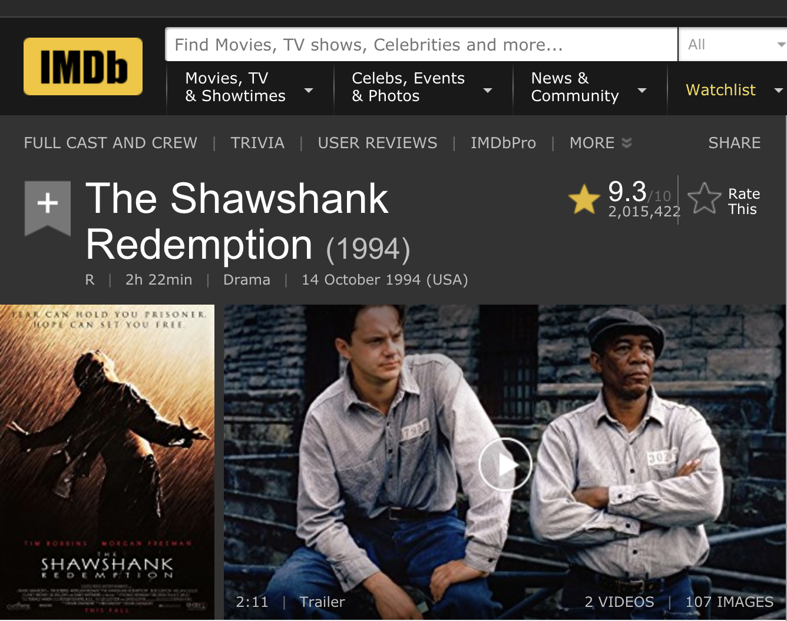
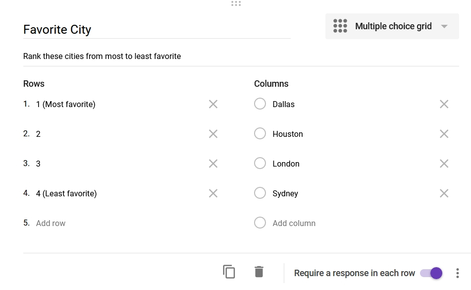
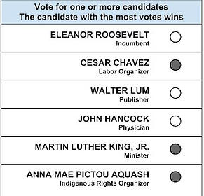

## Range voting (also known as score voting)

In range voting, voters give a number from a range (for example 0 to 10) for each candidate in the election. The one with the highest average number of the vote wins.

For example, in the image below which shows an example of a range vote of Pokemon.

**So, where can we find the example of range vote in the real world?**

 1. First and obvious, in the App Store and Google Play, each application has an average rating from their uses. (From 1 to 5 stars)
 2. In IMDb, each movie is rated from 1 to 10 by various users

 

 For example, the movie 'The Shawshank Redemption' has a rating of 9.3 / 10, which is a very high score among the IMDb.

## Instant runoff voting (2 round) (IRV)

This type of voting system is used in the single-seat election.

Instead of a single winner, IRV ranks each candidate from the voters' choices of 'most favorite and least'.

**How it works**

 1. Voters are given a list of candidates in the election.
 2. Then voters are required to put each candidate in the position of most favorite to least.
 3. Then the system counts each voter's top choices, losing candidates are eliminated and redistributed.
 5. When the number of candidates is reduced to two, it has become an "instant runoff" that allows a comparison of the top two candidates head-to-head.

For example, in the image below which shows an example of range vote of choosing favorite cities.

## Approval voting

Approval voting is a single-winner voting method that allows voters to choose any number of candidates. The candidate with the highest votes wins.

**Use cases in real world**

 1. For example, in an online survey, they may ask you to tick the things you like for gathering information.

## Random Ballot (lottery voting)

To explain this in the easiest way, I would say it is like the lottery.

In this type of voting system, the ballot of a single voter is selected at random, and that ballot decides the result of the election.

The result of the election pretty much depends on luck and probability. Therefore, each candidate or option wins with a probability exactly equal to the fraction of the electorate favoring that candidate or option.

 - The random ballot method is decisive, in that there is no possibility of a tied vote, assuming that the selected voter has expressed a preference (if not then another ballot can be selected at random).

 - It is unbiased, in that the probability of a particular result is equal to the proportion of total support that that result has in all the votes. When used in a single-winner contest, it is also strategy-free, in that there is no advantage in tactical voting. But it is not deterministic, in that a different random selection could have produced a different result, and it does not conform to majority rule since there is a possibility that the selected voter may be in the minority.

**Use cases of random vote**

 1. Lottery, as all the options are in the box, the option that is chosen randomly is the winner.
 2. Online lottery which is held by companies(for example Amazon or eBay), each customer has a chance to draw a lottery for different prizes.

## Ranked pairs

Ranked pairs select a single winner.

**How it works**
 1. The voter is given a pair of the candidate. (For example A, B, and C)
 2. The user will sort or rank the candidate in each pair. (For example B > A > C)
 3. The system will sort each candidate in the overall preferences of various voters.

In the example above, Nashville is the winner (where arrows point away from the winner).

 
**Resources**
 1. https://en.wikipedia.org/wiki/Ranked_pairs
 2. https://en.wikipedia.org/wiki/Instant-runoff_voting#Examples
 3. https://rangevoting.org/

